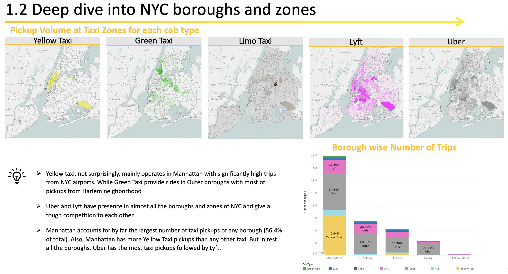

# New York City Cab Rides Analysis

## Description

In this analysis, I used the New York City Taxi & Limousine Commission (TLC) dataset of February 2019 with 26+MM taxi trip records of Green Taxi, Yellow Taxi, Limo, Juno, Uber, Lyft and Via. Taken as a whole, the detailed trip-level data is more than just a vast list of taxi pick up and drop off coordinates: it’s a story of New York.

## Key questions answered in this analysis:

*	What are the Taxi Trips Market Share of various public and private taxis in NYC? How Pickup Volume in all boroughs for each cab type differs? Are there any patterns in hourly trip trends and average trip time?
*	Are there untapped revenue opportunities at NYC Airports and using shared rides for NYC TLC?
*	Can TLC unleash business potential by introducing Shared Rides?
*	Which are the pick-up hotspots and can they be identified using clustering for day and night slots?
*	How can we outsmart traffic in Manhattan and avoid unfriendly zones during traffic hours?

## Datasets Used

*	[TLC Trip Record Data for February 2019](https://www1.nyc.gov/site/tlc/about/tlc-trip-record-data.page)

## Content

*	Python notebook with data data-preprocessing steps
*	Final Presentation containing the insights and recommendations.

